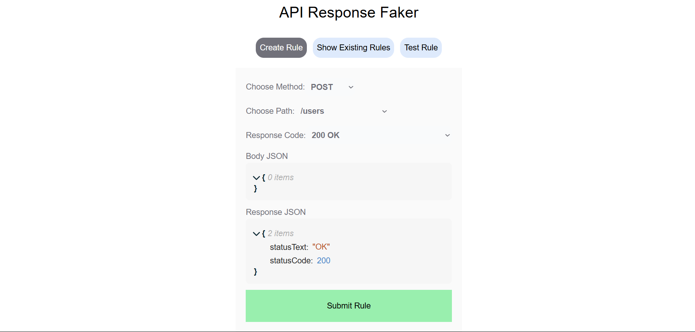
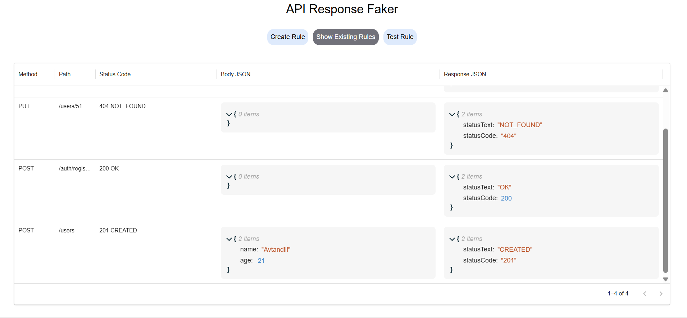
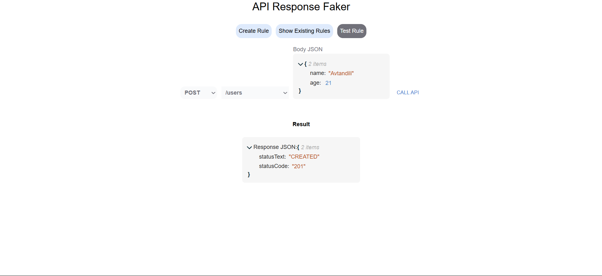

# Project: API Response Faker

## 👥 Team Information
- **Team Members**: Solo project

## 🎯 Project Vision

**Problem Statement**:  
During development, it’s common to need API responses from services that haven’t been implemented yet or are temporarily unavailable. This leads to blocked UI progress or error-prone mocking.

**Target Users**:  
- Frontend developers
- QA engineers
- Backend teams working with incomplete service contracts

**Value Proposition**:  
This tool allows users to set up fake API rules dynamically, simulating real responses. With a user-friendly UI and flexible backend, teams can prototype, test, or develop without needing a live backend.

---

## 🏗️ Architecture & Technical Design

### Tech Stack
- **Frontend**: React + TypeScript
- **UI Styling**: TailwindCSS + Material UI (DataGrid)
- **Notifications**: React Toastify
- **API Requests**: Axios
- **Backend**: Node.js + Express + TypeScript
- **Database**: SQLite (with better-sqlite3)

### System Architecture

- **Component Hierarchy**:
  - `App.tsx`
    - `RuleForm` (with JSON Editor for `response` and `body`)
    - `RulesTable` (Material UI)
    - `ToastContainer`

- **API Design**:
  - `GET /rules` – Retrieve all rules
  - `POST /rules` – Add a new rule
  - `ALL *` – Simulate fake endpoints dynamically

- **Database Schema**:
  - `api_rules` table:
    - `id`, `path`, `method`, `code`, `response`, `body`

- **Authentication**: No authentication — dev tool intended for local/internal use

### Key Design Decisions
- Used `jsoneditor-react` to provide a structured, user-friendly JSON input experience
- Used `better-sqlite3` for performant local data persistence
- Enabled flexible request matching by using `method + path` combo and dynamic response formatting

---
### Key Design Decisions
- Used `better-sqlite3` for its simplicity and performance in small-scale mock DBs.
- Built custom logic to match fake routes using HTTP method and path.
- Used Material UI `DataGrid` for better performance and flexibility in displaying rule sets.

---

## 🧪 Test-Driven Development Strategy

### Core Features to Test:
- Rule creation form (validations)
- API rule matching logic (backend catch-all)
- Database uniqueness enforcement
- JSON response rendering in frontend

### Testing Approach:
- Manual testing with known paths/methods
- Devtools + Postman for backend rule match verification

### Test Coverage Goals:
- Future scope includes integrating Jest + Supertest for backend
- Cypress for end-to-end frontend tests

---

## 📦 Feature Breakdown

### Core Features (Must-Have)
- [x] Form to define fake API rules (`path`, `method`, `code`, `response`, `body`)
- [x] Table to display all rules (MUI DataGrid)
- [x] Catch-all backend route to simulate fake endpoints
- [x] SQLite storage with fast lookup
- [x] Toast notifications for user feedback

### Enhanced Features (Nice-to-Have)
- [ ] Dynamic route support (e.g. `/users/:id`)
- [ ] Response delay simulation
- [ ] Headers support
- [ ] Import/export rule set
- [ ] Auth-protected admin panel

---

## 📅 Development Plan

### 1: Planning & Setup
- [x] Setup React + Tailwind + MUI
- [x] Setup Express + SQLite + TypeScript
- [x] Setup DB schema and init script

### 2: Minimal App + Testing
- [x] Implement rule creation + display UI
- [x] Create `/rules` API endpoints
- [x] Basic form validation
- [x] Connect Axios to backend

### 3: Mock Route Logic
- [x] Implement catch-all route (`app.all('*')`)
- [x] Match requests with DB rules
- [x] Parse and send JSON response
- [ ] Add optional response headers/delay

### 4: UI Polish + Final Touches
- [x] Add toasts and error feedback
- [x] Screenshot documentation
- [x] README and demo setup
- [ ] (Optional) Unit testing

---

## 🚀 Deployment Strategy
- **Current**: Local development only
- **Future Plans**:
  - Containerized with Docker
  - Deploy via Render or Railway for staging
  - Use `.env` for config (port, DB path)

---

## 📚 Documentation Plan
- **README**: Project vision, architecture, usage, stack
- **Screenshots**: 3 key UI screens included (form, table, response test)
- **API Docs**:
  - `GET /rules` – return all stored rules
  - `POST /rules` – create a new fake rule
  - `*` wildcard – return mock data if rule matches
- **Database Docs**:
  - `api_rules (id, path, method, code, response, body)`
- **Testing Docs**: Manual testing flow (future: Jest test suite)

---

## 🤔 Potential Challenges & Solutions

**Challenge 1**: Matching dynamic paths (e.g. `/users/:id`)  
- *Solution approach*: Use `path-to-regexp` to normalize and match parameters.

**Challenge 2**: SQLite `NULL` values bypassing uniqueness  
- *Solution approach*: Normalize `null` values to empty strings and check manually before insert.

**Challenge 3**: Managing user inputted JSON (validation)  
- *Solution approach*: Use `try/catch` and `JSON.stringify` safely with fallbacks and proper error toasts.

---

## 📈 Success Metrics

- **Functionality**: All rules create, list, and simulate endpoints accurately
- **Code Quality**: Uses TypeScript types throughout; modular and clean
- **Performance**: Fast DB reads with `better-sqlite3`; responsive UI
- **User Experience**: Clean form, clear errors, responsive table, and toast feedback

---

## 🖼️ Screenshots

## 📝 How to Run Locally

## 🚀 Clone & Run Locally

# 1. Clone the repository
`git clone https://github.com/your-username/api-response-faker.git`

# 2. Navigate to the backend folder and install dependencies
- `cd api-response-faker/back-end`
- `npm install`

# 3. Start the backend server
`npm run dev`

# (Optional) If you need to initialize your own SQLite database, make sure db file exists in /back-end

# 4. Open a new terminal and start the frontend
- `cd ../front-end`
- `npm install`
- `npm run dev`

# 5. Visit the frontend at:
`http://localhost:5173`

# Backend runs at:
`http://localhost:3000`
